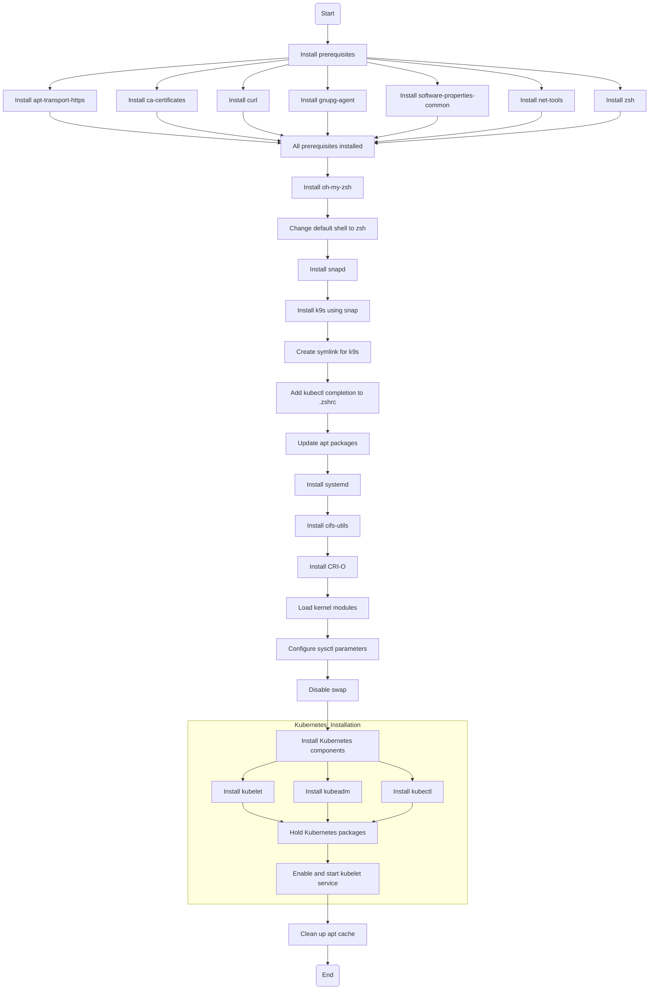
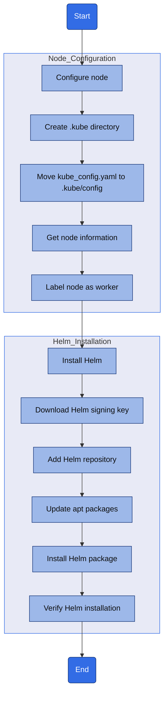

## common/install.sh

```mermaid
flowchart TD
    start(Start) --> prereqs[Install prerequisites]
    prereqs --> apt_transport_https[Install apt-transport-https]
    prereqs --> ca_certificates[Install ca-certificates]
    prereqs --> curl[Install curl]
    prereqs --> gnupg_agent[Install gnupg-agent]
    prereqs --> software_properties_common[Install software-properties-common]
    prereqs --> net_tools[Install net-tools]
    prereqs --> zsh[Install zsh]
    
    apt_transport_https & ca_certificates & curl & gnupg_agent & software_properties_common & net_tools & zsh --> all_prereqs[All prerequisites installed]
    
    all_prereqs --> oh_my_zsh[Install oh-my-zsh]
    oh_my_zsh --> change_shell[Change default shell to zsh]
    change_shell --> snapd[Install snapd]
    snapd --> k9s[Install k9s using snap]
    k9s --> symlink[Create symlink for k9s]
    symlink --> kubectl_completion[Add kubectl completion to .zshrc]
    kubectl_completion --> update_apt[Update apt packages]
    update_apt --> install_systemd[Install systemd]
    install_systemd --> install_cifs_utils[Install cifs-utils]
    install_cifs_utils --> install_cri_o[Install CRI-O]
    install_cri_o --> load_modules[Load kernel modules]
    load_modules --> sysctl_config[Configure sysctl parameters]
    sysctl_config --> disable_swap[Disable swap]
    disable_swap --> install_k8s[Install Kubernetes components]
    
    subgraph Kubernetes_Installation
        install_k8s --> install_kubelet[Install kubelet]
        install_k8s --> install_kubeadm[Install kubeadm]
        install_k8s --> install_kubectl[Install kubectl]
        install_kubelet & install_kubeadm & install_kubectl --> hold_packages[Hold Kubernetes packages]
        hold_packages --> enable_kubelet[Enable and start kubelet service]
    end
    
    enable_kubelet --> clean_apt[Clean up apt cache]
    clean_apt --> END(End)     
```

Vagrant Cheat Sheet: https://gist.github.com/wpscholar/a49594e2e2b918f4d0c4

## control-plane/configure.sh

```mermaid
flowchart TD
    start(Start) --> install_k8s[Install Kubernetes]
    install_k8s --> kubeadm_init[Run kubeadm init with config file]
    kubeadm_init --> prepare_kubectl[Prepare kubectl]
    prepare_kubectl --> create_join_file[Create join file for worker nodes]
    create_join_file --> setup_kube_config[Setup kube config for vagrant user]
    setup_kube_config --> untaint_node[Untaint control plane node]
    untaint_node --> install_calico[Install Calico CNI]
    
    install_calico --> wait_calico[Wait for Calico pod to be ready]
    wait_calico --> install_helm[Install Helm]
    
    subgraph Helm_Installation
        install_helm --> add_helm_repo[Add Helm repository]
        add_helm_repo --> update_apt[Update apt packages]
        update_apt --> install_helm_pkg[Install Helm package]
    end
    
    install_helm --> setup_storage[Setup local path storage]
    setup_storage --> install_ingress[Install NGINX Ingress Controller]
    install_ingress --> verify_ingress[Verify Ingress Controller version]
    
    subgraph helm-apps.sh
        verify_ingress --> install_dashboard[Install Kubernetes Dashboard]
        install_dashboard --> create_dashboard_sa[Create service account for dashboard]
        create_dashboard_sa --> create_dashboard_crb[Create cluster role binding for dashboard]
        create_dashboard_crb --> get_dashboard_token[Get access token for dashboard]
        
        get_dashboard_token --> install_cert_manager[Install cert-manager]
        install_cert_manager --> test_cert_manager[Test cert-manager installation]
        test_cert_manager --> create_letsencrypt[Create Let's Encrypt Issuer]
        
        create_letsencrypt --> install_falco[Install Falco]
        install_falco --> configure_falco_slack[Configure Falco Slack integration]
        
        configure_falco_slack --> install_chaos_mesh[Install Chaos Mesh]
    end
    
    install_chaos_mesh --> deploy_nginx[Deploy NGINX test app]
    deploy_nginx --> deploy_persistent_pod[Deploy persistent pod with local path]
    deploy_persistent_pod --> END(End)

    style start fill:#326CE5, stroke:#0F3074, color:#FFFFFF
    style END fill:#326CE5, stroke:#0F3074, color:#FFFFFF
    style Helm_Installation fill:#E8EAF6, stroke:#326CE5
    style helm-apps.sh fill:#E8EAF6, stroke:#326CE5
    style install_k8s fill:#9DB8E9, stroke:#0F3074, color:#0C0C0C
    style kubeadm_init fill:#9DB8E9, stroke:#0F3074, color:#0C0C0C  
    style prepare_kubectl fill:#9DB8E9, stroke:#0F3074, color:#0C0C0C
    style create_join_file fill:#9DB8E9, stroke:#0F3074, color:#0C0C0C
    style setup_kube_config fill:#9DB8E9, stroke:#0F3074, color:#0C0C0C
    style untaint_node fill:#9DB8E9, stroke:#0F3074, color:#0C0C0C
    style install_calico fill:#9DB8E9, stroke:#0F3074, color:#0C0C0C
    style wait_calico fill:#9DB8E9, stroke:#0F3074, color:#0C0C0C
    style install_helm fill:#9DB8E9, stroke:#0F3074, color:#0C0C0C
    style add_helm_repo fill:#9DB8E9, stroke:#0F3074, color:#0C0C0C
    style update_apt fill:#9DB8E9, stroke:#0F3074, color:#0C0C0C
    style install_helm_pkg fill:#9DB8E9, stroke:#0F3074, color:#0C0C0C
    style setup_storage fill:#9DB8E9, stroke:#0F3074, color:#0C0C0C
    style install_ingress fill:#9DB8E9, stroke:#0F3074, color:#0C0C0C
    style verify_ingress fill:#9DB8E9, stroke:#0F3074, color:#0C0C0C
    style install_dashboard fill:#9DB8E9, stroke:#0F3074, color:#0C0C0C
    style create_dashboard_sa fill:#9DB8E9, stroke:#0F3074, color:#0C0C0C
    style create_dashboard_crb fill:#9DB8E9, stroke:#0F3074, color:#0C0C0C
    style get_dashboard_token fill:#9DB8E9, stroke:#0F3074, color:#0C0C0C
    style install_cert_manager fill:#9DB8E9, stroke:#0F3074, color:#0C0C0C
    style test_cert_manager fill:#9DB8E9, stroke:#0F3074, color:#0C0C0C
    style create_letsencrypt fill:#9DB8E9, stroke:#0F3074, color:#0C0C0C
    style install_falco fill:#9DB8E9, stroke:#0F3074, color:#0C0C0C
    style configure_falco_slack fill:#9DB8E9, stroke:#0F3074, color:#0C0C0C
    style install_chaos_mesh fill:#9DB8E9, stroke:#0F3074, color:#0C0C0C
    style deploy_nginx fill:#9DB8E9, stroke:#0F3074, color:#0C0C0C
    style deploy_persistent_pod fill:#9DB8E9, stroke:#0F3074, color:#0C0C0C
```

## node-worker/configure.sh

```mermaid
flowchart TD
    start(Start) --> configure_node[Configure node]
    
    subgraph Node_Configuration
        configure_node --> create_kube_dir[Create .kube directory]
        create_kube_dir --> move_kube_config[Move kube_config.yaml to .kube/config]
        move_kube_config --> get_nodes[Get node information]
        get_nodes --> label_node[Label node as worker]
    end
    
    label_node --> install_helm[Install Helm]
    
    subgraph Helm_Installation
        install_helm --> download_signing_key[Download Helm signing key]
        download_signing_key --> add_helm_repo[Add Helm repository]
        add_helm_repo --> update_apt[Update apt packages]
        update_apt --> install_helm_pkg[Install Helm package]
        install_helm_pkg --> verify_helm[Verify Helm installation]
    end
    
    verify_helm --> END(End)
    
    style start fill:#326CE5, stroke:#0F3074, color:#FFFFFF
    style END fill:#326CE5, stroke:#0F3074, color:#FFFFFF
    style Node_Configuration fill:#E8EAF6, stroke:#326CE5
    style Helm_Installation fill:#E8EAF6, stroke:#326CE5
    style configure_node fill:#9DB8E9, stroke:#0F3074, color:#0C0C0C
    style create_kube_dir fill:#9DB8E9, stroke:#0F3074, color:#0C0C0C
    style move_kube_config fill:#9DB8E9, stroke:#0F3074, color:#0C0C0C
    style get_nodes fill:#9DB8E9, stroke:#0F3074, color:#0C0C0C
    style label_node fill:#9DB8E9, stroke:#0F3074, color:#0C0C0C
    style install_helm fill:#9DB8E9, stroke:#0F3074, color:#0C0C0C
    style download_signing_key fill:#9DB8E9, stroke:#0F3074, color:#0C0C0C
    style add_helm_repo fill:#9DB8E9, stroke:#0F3074, color:#0C0C0C
    style update_apt fill:#9DB8E9, stroke:#0F3074, color:#0C0C0C
    style install_helm_pkg fill:#9DB8E9, stroke:#0F3074, color:#0C0C0C
    style verify_helm fill:#9DB8E9, stroke:#0F3074, color:#0C0C0C
```